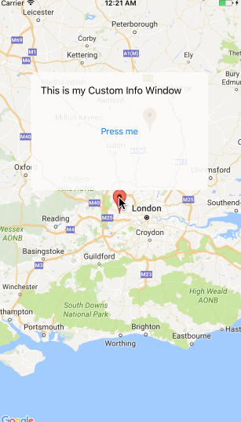

## Interactive custom InfoWindow for Google Maps iOS


A way of making info windows in Google Maps interactive (especially clicable buttons). Tutorial can be found [here](https://nagam11.github.io/nagam11.github.io/GoogleMaps-custom-InfoWindow/).

### Setup

Replace the Google Maps API key with your key.

```
GMSServices.provideAPIKey("YOUR-API-KEY")
```
