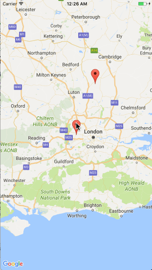

## Interactive custom InfoWindow for Google Maps iOS
An interactive InfoWindow in Google Maps. Tutorial can be found [here](https://nagam11.github.io/nagam11.github.io/GoogleMaps-custom-InfoWindow/).


### Setup

Replace the Google Maps API key with your key.

```
GMSServices.provideAPIKey("YOUR-API-KEY")
```
